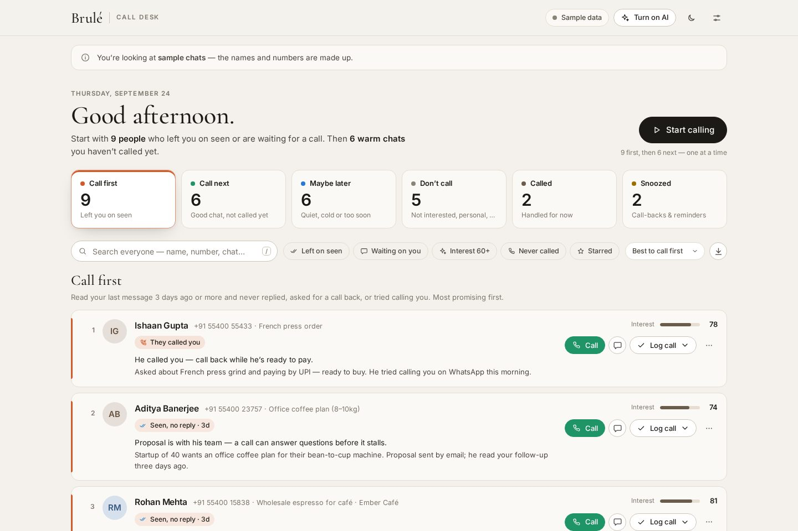
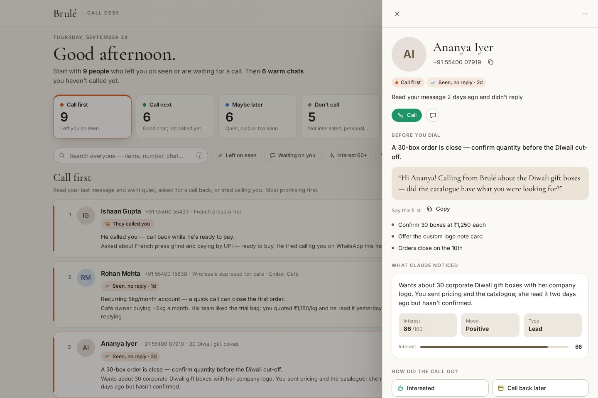
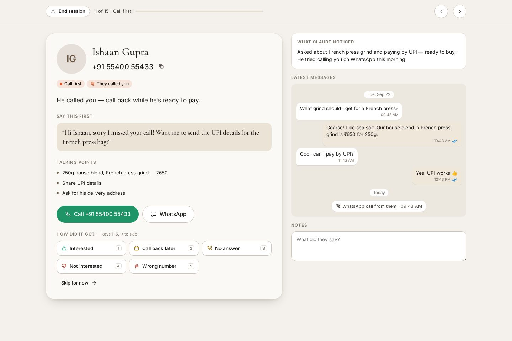
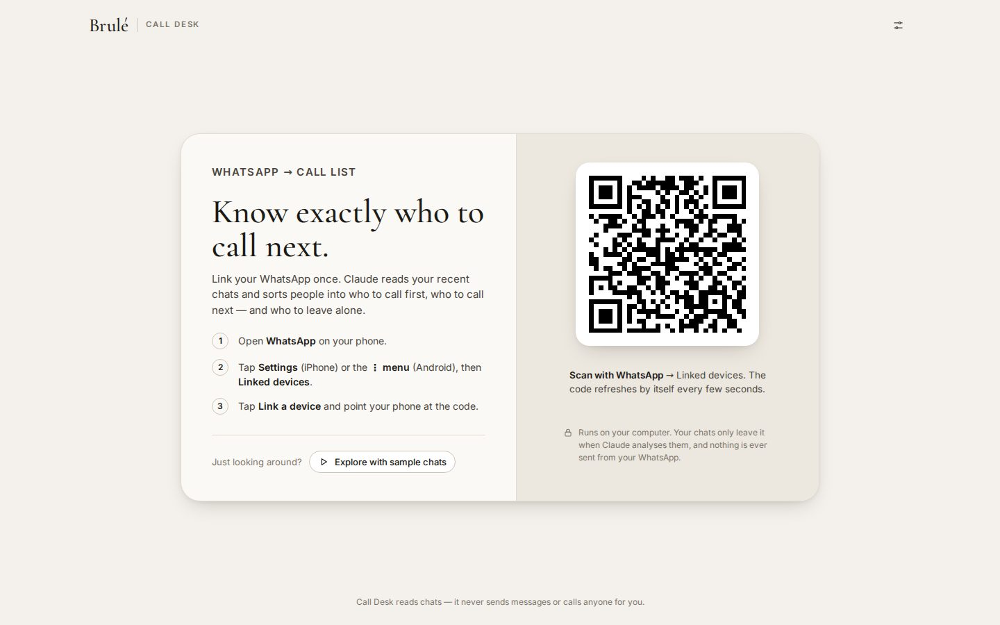

# Brulé Call Desk

**Your WhatsApp chats, read by Claude and turned into a call list.**

Link WhatsApp by scanning a QR code. Call Desk reads your recent chats, including the blue ticks, and Claude works out who is worth calling. You get one list of who to call first, who to call next, and who to leave alone.



## What you get

- **Scan to connect.** It links to your WhatsApp like WhatsApp Web does. You scan once and it remembers you.
- **Your lists, sorted:**

| List | Who lands here |
|---|---|
| 🟠 **Call first** | Read your last message 3 or more days ago and didn't reply (*left on seen*). Also anyone who asked you to call back when that time has come, and anyone who tried calling you. |
| 🟢 **Call next** | You had a good chat, or they seem interested, and you haven't called yet. Also people who wrote last and are waiting on you. |
| 🔵 **Maybe later** | Your message was delivered but not read yet. Also lukewarm chats where it's been less than 3 days since they read your message, and chats that have been quiet for more than 45 days. |
| ⚪ **Don't call** | Said no, or it's a wrong number. Also friends and family, spam, and automated messages. |
| 🟤 **Called** | You logged a call, or called on WhatsApp, after their last message. |
| 🟡 **Snoozed** | Call-backs and snoozes. They come back to the top when the time comes. |

- **Claude's read of every chat.** An interest score from 0 to 100, their mood, and what they want. Plus a one-line reason to call, **what to say first** (in the language they write in), and up to 3 talking points.
- **Start calling mode.** It shows one person at a time with a big call button. There's also a QR code you can scan with your phone to dial straight away. Log how each call went with the keys 1–5. Call Desk then moves each person to the right list.
- Search, filters (*Left on seen*, *Waiting on you*, *Interest 60+*, *Never called*), notes, stars, snooze, and a **CSV download** of today's list.
- A light and a dark theme, and it works on small screens.

| Contact panel | Calling session |
|---|---|
|  |  |

## Set up (one time, about 5 minutes)

1. **Install Node.js** from [nodejs.org](https://nodejs.org). Pick the LTS version and click through the installer.
2. **Get the code.** Download this repository as a ZIP from GitHub (green **Code** button → **Download ZIP**) and unzip it.
3. **Start it.** Open the `whatsapp-call-desk` folder and double-click:
   - **Windows:** `Start Call Desk.bat`
   - **Mac:** `Start Call Desk.command`. The first time, macOS may say it's from an unidentified developer. If so, right-click the file, choose **Open**, then **Open** again.

   The first start installs everything, including a private copy of Chrome that Call Desk uses to run WhatsApp Web in the background. That's about 200 MB and happens only once. Then your browser opens the dashboard at **http://localhost:3000**. Keep the black window open while you use it; closing it stops Call Desk.
4. **Scan the QR code.** On your phone, open WhatsApp and go to **Settings** (iPhone) or the **⋮ menu** (Android). Tap **Linked devices**, then **Link a device**.

   
5. **Turn on the AI.** Click **Turn on AI** (or ⚙ Settings) and paste your Claude API key. You can create one at [console.anthropic.com](https://console.anthropic.com/settings/keys). You can also put it in a `.env` file instead (copy `.env.example`).

After that, just double-click the start file whenever you want your list. You stay logged in. On the first sync Call Desk reads your most recent 150 chats, which takes a minute or two. Claude then reads them one by one, and the list fills in as it goes.

**Prefer the terminal?** In the `whatsapp-call-desk` folder, run `npm install` once, then `npm start` each time.

**Want to look around first?** Run `npm run demo` to open the dashboard with 30 made-up sample chats. WhatsApp isn't started in this mode.

## How it decides

**Left on seen.** WhatsApp shows ✓ for sent, grey ✓✓ for delivered and blue ✓✓ for read. Call Desk counts someone as *left on seen* when all of these are true:
- your last message has blue ticks
- they read it at least 3 days ago and still haven't replied (you can change this to anything from 1 to 7 days in Settings)
- it actually expected an answer, like a question, a price, an offer or a follow-up

A sign-off like "thanks!" or "you're welcome ☕" doesn't count. People who turned read receipts off never show blue ticks, so they appear as *Delivered, not read*.

**Calls.** WhatsApp calls are picked up from the chat automatically. Ordinary phone calls aren't visible to WhatsApp, so log them with **Log call** (or keys 1–5 while calling). A logged call only counts until they message you again. After that they're back in the running.

**Your say wins.** You can move anyone to another list, star them to keep them near the top, or snooze them. *Let the AI decide again* undoes a manual move.

## What it costs

Claude reads each chat once, and reads it again only when new messages arrive. As a rough guide, a first read of 150 chats costs about **$2–3 with Claude Opus 5** (the default and most thorough). It's about $1 with Sonnet 5 and about $0.50 with Haiku 4.5. You can switch models in Settings. After the first read, costs are tiny. Prices are on [claude.com/pricing](https://claude.com/pricing#api).

Without an API key, Call Desk still works. It sorts chats with a quick keyword read, but without summaries, openers or talking points.

## Privacy

- It runs only on your computer, and the dashboard only answers on `localhost`.
- Synced chats, your call log and notes are saved in the `data/` folder. That folder is git-ignored and never committed. To delete everything, use **Settings → Clear all data**, or delete the folder.
- When Claude analyses a chat, that chat's recent messages are sent to Anthropic's API. Nothing else leaves your computer.
- Call Desk **never sends WhatsApp messages or places calls.**

> **Heads-up:** WhatsApp doesn't officially support third-party tools that connect as a linked device. Call Desk uses the open-source [whatsapp-web.js](https://github.com/pedroslopez/whatsapp-web.js) library. Only reading your own chats is low-key, but WhatsApp can restrict accounts that use unofficial clients, so use it at your own discretion.

## Settings

| Setting | Default | What it does |
|---|---|---|
| Model | Claude Opus 5 | Opus 5 is the most thorough. Sonnet 5 and Haiku 4.5 are cheaper. |
| Analyze automatically | On | Claude reads new or changed chats right after each sync. |
| What you do | Brulé description | Tells Claude what counts as "interested". Edit this. |
| "Left on seen" after | 3 days | How long they can sit on your message (read, no reply) before they go to Call first. |
| Gone cold after | 45 days | Older chats drop to Maybe later. |
| Friends & family / groups | Off | Personal chats and groups stay off the call list. |
| Chats / messages / days | 150 / 40 / 120 | How much of WhatsApp to read on each sync. |

## Troubleshooting

- **The QR code never appears, or you see "Couldn't open WhatsApp Web".** Check your internet connection and click **Try again**. If it keeps failing, update the WhatsApp library with `npm install whatsapp-web.js@latest`, because WhatsApp changes its web app from time to time.
- **"Chrome could not be found".** Run `npx puppeteer browsers install chrome`, or set `CHROME_PATH` in `.env` to your own Chrome.
- **Logged out.** If you removed the linked device on your phone, click the connection pill at the top and scan again.
- **Port 3000 is busy.** Put `PORT=3001` in `.env`.
- **A number says "hidden by WhatsApp".** Some contacts use WhatsApp's privacy IDs, so their number isn't shared with linked devices. Use the WhatsApp button to reach them.

## For developers

```
server/
  index.js      Express API + live updates (Server-Sent Events)
  whatsapp.js   whatsapp-web.js wrapper: QR login, chat sync, read ticks, call logs
  signals.js    facts measured from a chat (left on seen, waiting on you, calls…)
  priority.js   the list rules and ranking
  analyzer.js   Claude analysis (structured output) + keyword fallback
  demo.js       sample chats for `npm run demo`
  views.js      contact view models, stats, CSV
public/         the dashboard (Preact + htm, no build step)
test/           npm test
```

Run the tests with `npm test`.
